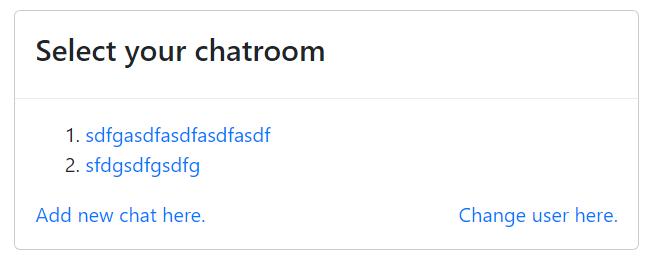
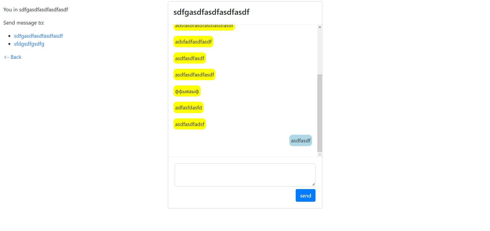
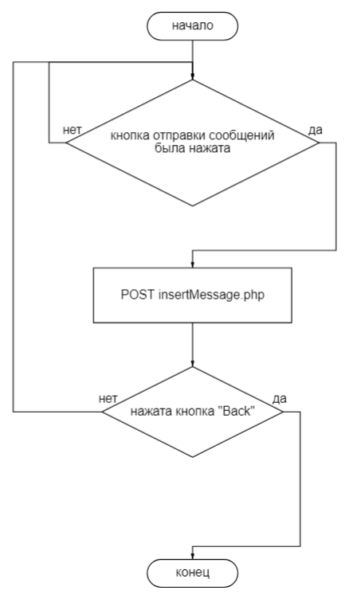
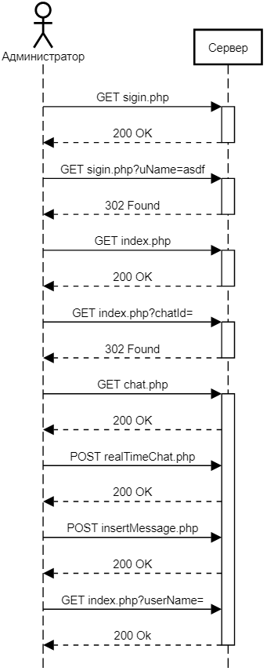

# ОТЧЁТ О ЛАБОРАТОРНОЙ РАБОТЕ №3
#### *По курсу "Основы Программирования"*
#### *Работу выполнил студент группы №3131 Баглаенко Е.Ю.*
#### [Ссылка на GitHub](https://github.com/scifipunk/lab3.git)

## Цель работы:
Разработать и реализовать анонимный част с возможностью создания каналов. В интерфейсе отображается список каналов, пользователь может либо подключиться к существующему каналу, либо создать новый. Сообщения доставляются пользователю без обновления страницы.

## Ход работы
### Пользовательский интерфейс
1. Список чатов                       
   
1. Чат пользователей                           
   

### Пользовательский сценарий
1. Пользователь попадает на страницу singin.php и вводит в текстовом поле его никнейм. После подтверждения он попадает на страницу, на которой он может выбрать либо существующий чат, либо создать новый. После перехода в чат, пользователь может отправлять сообщения и получать их, с частотой в 0.7 секунды, без обновления страницы, его сообщения выделены синим цветом, а сообщения других пользователей выделены желтым. Также в правой части страницы пользователь может переключаться между чатами.

### API сервера

В основе приложения использована клиент-серверная архитектура. Обмен данными между клиентом и сервером осуществляется с помощью POST- и GET- запросов. В теле POST запроса отправки сообщения используется поля, 'fromUser', 'toChat'  'message', а в поле  GET запроса используются поля 'curUser' и 'toChat' и другие. Для передачи 'id' текущего пользователя используется суперглобальная переменная SESSION.

### Хореография
1. *Отправка сообщения*. Принимается введенное сообщение и картинка. Введенное сообщение передается при помощи функции *$.ajax* в *insertMessage.php*, где сообщению присваивается id отправителя и чата, и само сообщение. После чего сообщение выводится на экран.
2. *Создание нового чата*. Кнопка **Add new chat.** пересылает пользователя на *addChat.php*, где пользователь вводит название чата, после чего перенаправляется обратно на *index.php*.

## Описание структуры базы данных
Браузерное приложение phpMyAdminДля используется для просмотра содержимого базы данных. Всего 3 таблицы столбцов:

Users:
1. "id" типа int с автоинкрементом для выдачи уникальных id всем пользователям
2. "User" типа varchar для хранения имени пользователя

Chatrooms:
1. "id" типа int с автоинкрементом для выдачи уникальных id всем чатам
2. "Chat" типа varchar для хранения названия чатов

Messages:

1. "id" типа int с автоинкрементом для выдачи уникальных id всем сообщения
2. "FromUser" типа int для хранения id отправителя сообщения
3. "toChat" типа int для хранения id чатое, в которое пришло сообщения
4. "Message" типа varchar для хранения текста сообщения


## Описание алгоритмов
1. Алгоритм отправки сообщения                        
                                         
         


## Пример HTTP запросов/ответов



## Значимые фрагменты кода
1. Скрипт, позволяющий отправлять и принимать сообщения без обновления страницы
```
<script type="text/javascript">
    document.getElementById("send").addEventListener('click', function() {    
            let msg = $("#message").val();
            
            $.ajax({
                url:"insertMessage.php",
                method:"POST",
                data:{
                    fromUser:$("#fromUser").val(),
                    toChat:$("#toChat").val(),
                    "message": msg
                },
                
                dataType:"text",
                success:function(data)
                {
                    $("#message").val("");
                }
            });    
    });

    setInterval(function(){
            $.ajax({
                url:"realTimeChat.php",
                method:"POST",
                data:{
                    fromUser: $("#fromUser").val(),
                    toChat: $("#toChat").val(),
                    /* "message": msg */
                },
                dataType:"text",
                success:function(data)
                {
                    $("#msgBody").html(data);
                }
            });
        }, 700);

</script>
```
2. Функция вывода сообщений
```
$fromUser = $_POST["fromUser"];
$toChat = $_POST["toChat"];
$message = $_POST["message"];
$output="";

$chats = mysqli_query($connect, "SELECT * FROM `messages` WHERE `ToChat` = '$toChat' ")
            or die("Failed to query database".mysql_error());
            while($chat = mysqli_fetch_assoc($chats))
            {
                if($chat['FromUser'] == $fromUser)
                    $output.= "<div style='text-align:right;'>
                    <p style='background-color:lightblue; word-wrap:break-word; display:inline-block; padding:5px; border-radius:10px; max width:70%;'>".$chat['Message']."
                    </p>
                    </div>";
                else
                    $output.= "<div style='text-align:left;'>
                    <p style='background-color:yellow; word-wrap:break-word; display:inline-block; padding:5px; border-radius:10px; max width:70%;'>".$chat['Message']."
                    </p>
                    </div>";
            }
        echo $output;
```
3. Функция загрузки сообщений в базу данных
```
<?php
require_once 'connect.php';

$fromUser = $_POST["fromUser"];
$toChat = $_POST["toChat"];
$message = $_POST["message"];

$output="";

$sql = "INSERT INTO messages (`FromUser`, `ToChat`, `Message`) VALUES('$fromUser','$toChat','$message')";

if($connect -> query($sql))
{
    $output.="";
}
else
{
    $output.="Error. Try again!";
}
echo $output;
?>
```
